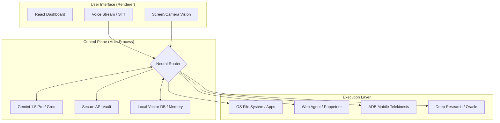

<div align="center">


# IRIS
### The Autonomous Neural OS Agent
**Local-first execution layer that turns voice and intent into real OS actions.**

[](https://opensource.org/licenses/MIT)
[](https://www.typescriptlang.org/)
[](https://react.dev/)
[](https://www.electronjs.org/)

---


</div>

## 🌌 Overview

**IRIS** is not a chatbot. It is a local-first **AI Operating System Layer** designed to execute complex, multi-step workflows across your system, web, and mobile devices. 

By bridging high-level LLMs (Gemini, Groq, Llama 3) with low-level system APIs, IRIS gives you a unified, "Vision-First" interface to control your digital environment using only your voice or simple commands.

> "Speak your command. IRIS executes it."

---

## 🏗️ System Architecture

IRIS operates as a secure bridge between the user's intent and the operating system's execution capabilities.



---

## ⚡ Core Capabilities

### 🖥️ Native OS Automation
- **App Management**: Launch (`Open App`) or terminate (`Close App`) any process instantly.
- **File System**: Semantic search (`Index Folder`), directory indexing, and autonomous file manipulation (Read, Write, Move, Delete).
- **Control**: AI-driven coordinate targeting (`Click on Screen`), global keyboard injection (`Phantom Typer`), and window management (`Teleport Windows`).

### 🔬 Intelligent Vision (OCR & UI)
- **Screen Peeler**: Instant UI-to-code extraction. "See" what's on the screen and interact with it programmatically.
- **Multimodal Vision**: Direct processing of screen frames (Camera/Desktop) to understand context and intent.
- **Ghost Coder**: Inline IDE generation (Ctrl+Alt+Space) triggered by screen context.

### 🌐 Autonomous Web & Research
- **Deep Research**: Multi-agent Llama 3 powered web crawling and data synthesis.
- **Web Agent**: Viral visual DOM manipulation and agentic web navigation using Puppeteer.
- **Wormhole**: Instantly expose or close local tunnels to the public internet for testing.

### 📱 Mobile Telekinesis
- **Android Integration (ADB)**: Full remote control of connected Android devices. 
- **Telemetry**: Read notifications, check hardware stats (Battery/Wi-Fi), and push/pull files.
- **Remote Execution**: Tap, swipe, and toggle hardware remotely from the IRIS dashboard.

### 🧠 Knowledge & Memory
- **Consult Oracle**: Perform deep RAG queries across your local codebases and documents.
- **Neural Forge**: Save "Core Memories" for persistent identity tracking and past context recall.
- **Semantic Search**: Vector-based local file retrieval using LanceDB.

---

## 🔒 Security & Privacy

IRIS is built with a **Local-First, Zero-Trust** mentality:
- **100% BYOK**: Bring Your Own Key. No API keys are stored on external servers.
- **OS-Level Encryption**: All sensitive keys are encrypted using the native OS keychain (SafeStorage).
- **Vault Architecture**: Biometric (Face Recognition) or PIN-based lockdown for sensitive modules.
- **Zero External Tracking**: Minimal data egress. IRIS communicates directly with AI providers for inference; all logic remains local.

---

## 🛠️ Technology Stack

| Layer | Technologies |
| :--- | :--- |
| **Foundation** | Electron, Node.js, TypeScript |
| **Frontend** | React 19, Tailwind CSS, Framer Motion, GSAP |
| **AI / ML** | Google Gemini, Groq, Hugging Face, Transformers.js, Tesseract (OCR) |
| **Database** | Supabase (Cloud Auth), VectorDB / LanceDB (Local RAG) |
| **OS Bridge** | `nut-js` (Automation), `node-window-manager`, ADB |
| **3D / Charts** | Three.js (Fiber), Recharts, React Flow |

---

## 🚀 Getting Started

### Prerequisites
- [Node.js](https://nodejs.org/) (Latest LTS)
- API Keys for Gemini or Groq (Recommended for the full experience)

### Installation

1. **Clone the Forge**
   ```bash
   git clone https://github.com/201Harsh/IRIS-AI.git
   cd IRIS-AI
   ```

2. **Environment Setup**
   ```bash
   cp .env.example .env
   # Add your API keys to .env
   ```

3. **Install Dependencies**
   ```bash
   npm install
   ```

4. **Ignite the System**
   ```bash
   npm run dev
   ```

5. **Initialize Vault**
   - Go to **Command Center** (Settings)
   - Store your keys securely in the **Secure Vault**.

---

## 🗺️ Roadmap
- [ ] **Voice-First Integration**: Deep OS-level ambient listener.
- [ ] **Plugin Marketplace**: Community-driven execution modules.
- [ ] **Neural Memory Graph**: Visual representation of "IRIS Core Memories".
- [ ] **Multi-Agent Swarm**: Parallel task execution across multiple LLMs.

---

## 📄 License
Distributed under the **MIT License**. See `LICENSE` for more information.

---

<div align="center">
Made with ❤️ by <b>Harsh Pandey</b>
<br/>
<i>"IRIS is not a chatbot. It is a neural extension of your operating system."</i>

[GitHub](https://github.com/201Harsh) • [Instagram](https://www.instagram.com/201harshs/) • [Portfolio](https://irisaiw.vercel.app)
</div>
