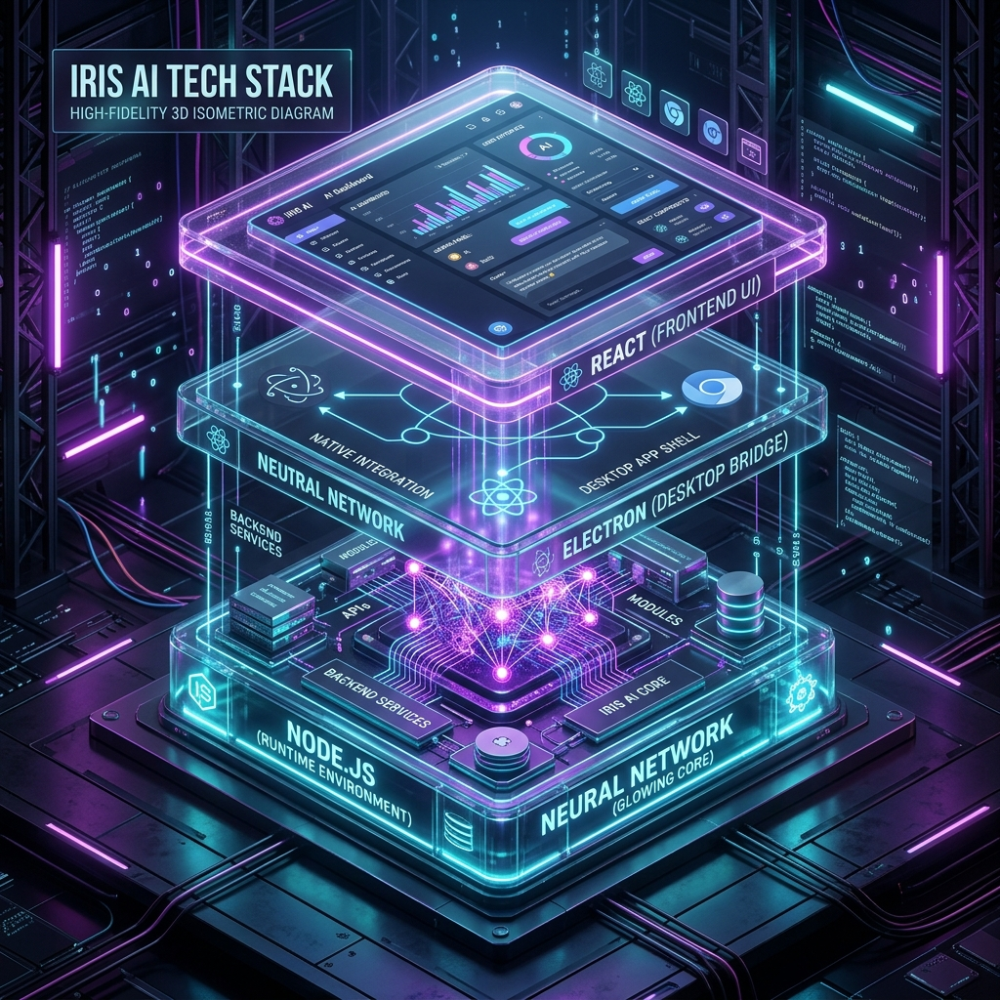
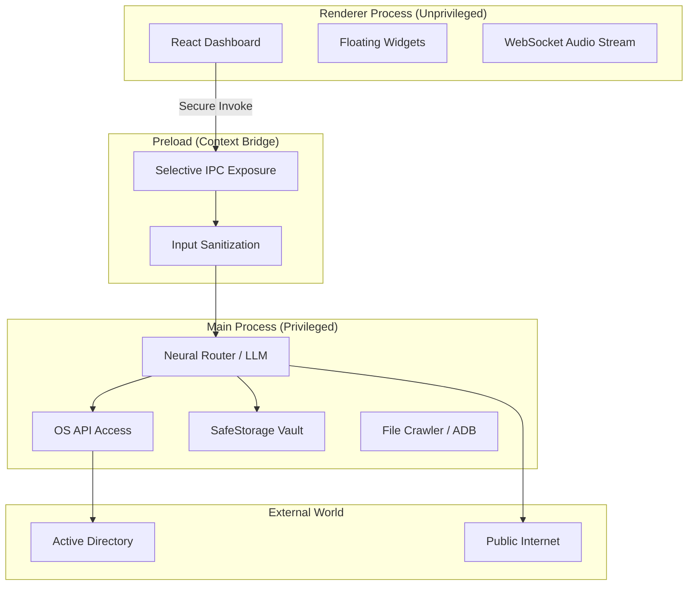
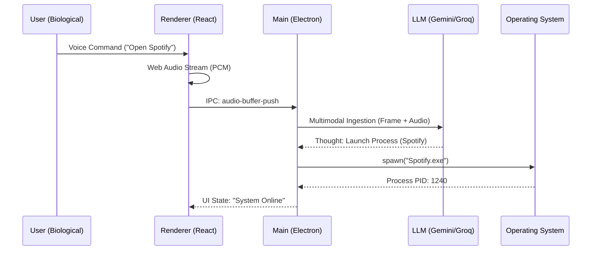
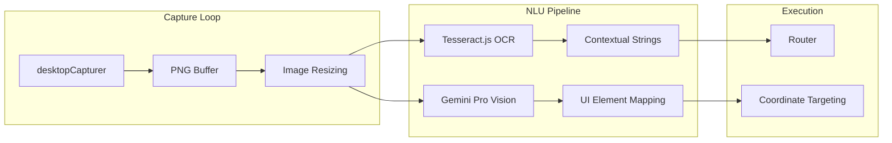
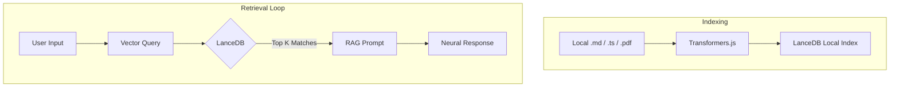
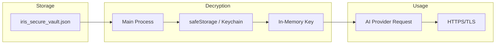

<div align="center">


# IRIS: The Neural Forge
### Autonomous Operating System Layer & Intelligence Forge

[](https://opensource.org/licenses/MIT)
[](https://www.typescriptlang.org/)
[](https://www.electronjs.org/)

---


</div>

## 🌌 Executive Philosophy

**IRIS** (Intelligent Real-time Integrated System) is a **Neural OS Layer**. It abstracts the traditional GUI into a **Neural Command Plane**, allowing high-level intent to be decomposed into deterministic system execution.

---

## 🏗️ Deep Architecture: The Multi-Process Core



### 1. Process Topology & Security
IRIS utilizes a **Multi-Process Architecture** to ensure that unprivileged UI code cannot directly execute system-level exploits.



---

## 🔬 Neural Pipelines (System Low-Level)

### 2. Voice-First Command Routing
How IRIS transforms biological audio waves into deterministic computer code.



### 3. Vision-First Screen Ingestion (The Peeler)
IRIS captures and "understands" your desktop content every 2 seconds.



### 4. Mobile Telekinesis (ADB Protocol)
Direct remote control of connected Android devices via the Android Debug Bridge.

```mermaid
graph TD
    subgraph "System PC"
        IPC[Renderer Request] --> ADB[Main: ADB Client]
        ADB --> Shell[execAsync('adb shell')]
    end

    subgraph "Android Device"
        Shell --> Battery[dumpsys battery]
        Shell --> Notifs[notification --noredact]
        Shell --> Control[input tap/swipe]
    end

    Battery --> Telemetry[Telemetry UI]
    Notifs --> Alerts[Desktop Toast]
```

---

## 🧠 Local Memory & Hybrid RAG

IRIS maintains a **Neural Forge** of local knowledge that never leaves the machine.



---

## 🔒 Security & Vault Locking

IRIS uses a **Zero-Trust Lockdown Flow** to protect your API credentials.



---

## 🛠️ Developer API Reference (Full IPC Table)

| Call Key | Payload Schema | Return Type | Description |
| :--- | :--- | :--- | :--- |
| `index-folder` | `{ folderPath: string }` | `Promise<string>` | Vectorizes a directory. |
| `adb-tap` | `{ xPercent: number, yPercent: number }` | `Promise<{success}>` | Remote Android touch. |
| `run-terminal` | `{ command: string }` | `Promise<string>` | Kernel shell execution. |
| `hack-website` | `{ url: string, mode: string }` | `Promise<{success}>` | DOM Hijacking / Emerald Theme. |
| `secure-save-keys`| `{ groqKey, geminiKey }` | `Promise<{success}>` | Encrypted keychain write. |

---

## 🚀 Deployment & Installation

### Requirements
- **Hardware**: Windows (Primary), Android Device (Optional for Telekinesis).
- **Environment**: `adb` must be in system PATH.

### Full Setup
```bash
# Clone the Forge
git clone 
npm install
npm run dev
```

---

<div align="center">

### 🛡️ Disclaimer
IRIS possesses deep system privileges. High-level automation carries risk.

**Crafted by [Team WinHAiJi]**  
*Engineered for the next generation of biological-digital interaction.*

</div>
