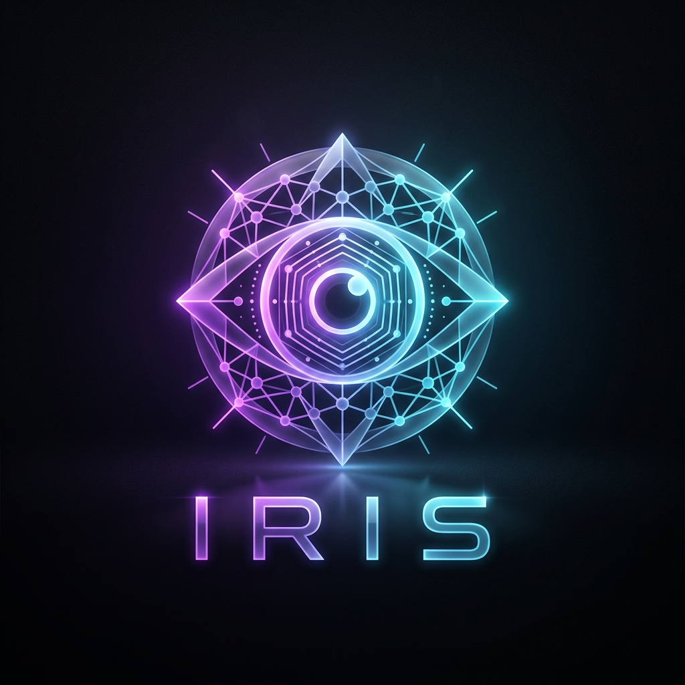
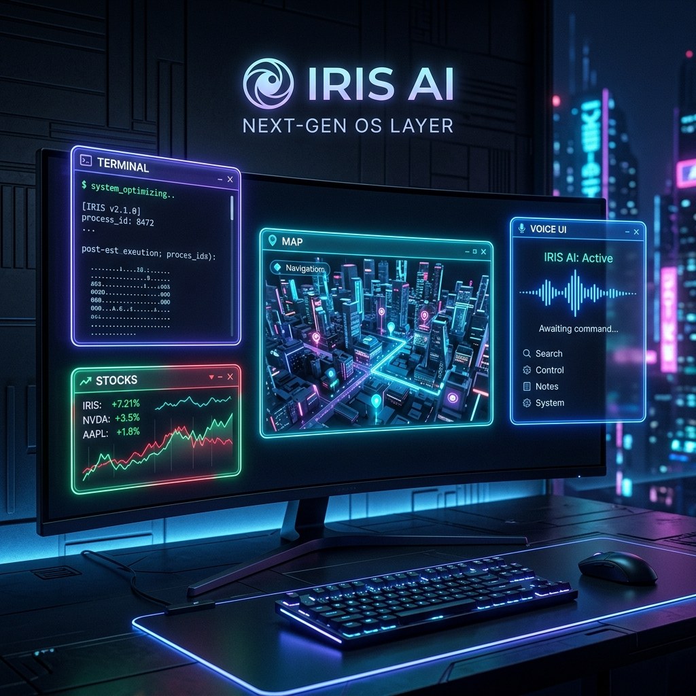

<div align="center">



# IRIS: The Neural Forge
### Autonomous Operating System Layer & Intelligence Forge
**Execute intent across Kernel, Web, and Mobile with zero-latency neural routing.**

[](https://opensource.org/licenses/MIT)
[](https://www.typescriptlang.org/)
[](https://www.electronjs.org/)
[](https://deepmind.google/technologies/gemini/)

---



</div>

## 🌌 Executive Philosophy

**IRIS** (Intelligent Real-time Integrated System) is not a standalone application; it is a **Neural OS Layer**. Traditional OS interfaces are built for manual input (CLI/GUI). IRIS abstracts these into a **Neural Command Plane**, where high-level intent is decomposed into deterministic system calls.

---

## 🏗️ Technical Architecture: The Dual-Process Model

IRIS leverages Electron's multi-process architecture to ensure **Kernel-level stability** and **UI responsiveness**.

### 1. The Main Process (The Core)
The "Heart" of IRIS. It holds privileged access to the OS.
- **Privileged Context**: Direct access to `fs`, `child_process`, `adb-shell`, and `raw-sockets`.
- **Logic Engine**: Houses the **Neural Router** which communicates with Gemini/Groq.
- **Security Vault**: Manages `safeStorage` encryption for all sensitive API credentials.

### 2. The Renderer Process (The Interface)
The "Eyes and Ears" of IRIS.
- **Voice Ingestion**: Real-time STT streaming via Web Audio API.
- **Vision Feed**: Captures 60FPS desktop/camera frames for multimodal analysis.
- **Widget Layer**: Floating React components (Glassmorphism UI) for real-time telemetry.

### 3. The Context Bridge (IPC)
A strictly typed, zero-trust bridge (`preload/index.ts`) that exposes only necessary handlers to the UI, preventing XSS-based system takeovers.

---

## 🔬 Core Module Deep-Dives

### 🔌 Mobile Telekinesis (ADB Protocol)
IRIS transforms your PC into a remote Android Command Center.
- **Protocol**: Raw ADB over TCP/IP or USB.
- **Telemetry Hash**: Real-time extraction of `dumpsys battery`, `df -h /data`, and `getprop`.
- **Notification Hook**: Scrapes `notification --noredact` to surface smartphone alerts directly in the OS desktop.
- **Remote Execution**:
    - `adb-tap`: Precise coordinate touch based on screen percentage.
    - `adb-swipe`: Directional gesture simulation for scrolling.
    - `adb-push/pull`: Seamless bi-directional file synchronization.

### 👁️ Screen Peeler (OCR Vision)
The Vision system allows IRIS to "read" your screen and turn UI elements into actionable data.
- **Workflow**: `desktopCapturer` -> `PNG Buffer` -> `Tesseract.js` (OCR) -> `Generative AI` (Contextualization).
- **Ghost Coder**: A specialized vision mode that detects code on screen and injects an AI-suggestions overlay (`Ctrl+Alt+Space`).

### 🕸️ Web Agent & Reality Hacker
IRIS creates a "Synthetic Web Layer" over existing websites.
- **Reality Hacker**: Injects custom CSS/JS to "Assimilate" any domain (GitHub, YouTube, Amazon) into the IRIS aesthetic.
- **Smart Routing**: Local-first bookmarking and keyword-based URL redirection.
- **Puppeteer Stealth**: Uses `puppeteer-extra-plugin-stealth` to bypass bot detection for deep research and summarization.

### 🧠 Semantic Memory (LanceDB RAG)
Local knowledge retrieval that never leaves your machine.
- **Vector Database**: Uses **LanceDB** for high-speed local embeddings.
- **Embedding Pipeline**: `Xenova/all-MiniLM-L6-v2` runs locally via Transformers.js.
- **Oracle Mode**: Performs a hybrid search (Keywords + Semantic) to find files across TBs of local storage in milliseconds.

---

## 🛠️ Developer API Reference (IPC Handlers)

IRIS exposes a powerful IPC API for creating new tools. Below is the exhaustive schema for `ipcMain.handle`:

| Call Key | Payload Schema | Description |
| :--- | :--- | :--- |
| `adb-connect` | `{ ip: string, port: string }` | Establish remote Android link. |
| `adb-telemetry` | `void` | Returns battery, storage, and model data. |
| `google-search` | `{ query: string }` | Opens external search and returns a Puppeteer summary. |
| `hack-website` | `{ url: string, mode: 'rewrite' \| 'emerald' }` | Injects IRIS themes into specific domains. |
| `index-folder` | `{ folderPath: string }` | Vectorizes a directory into LanceDB. |
| `run-terminal` | `{ command: string }` | Executes a raw shell command and returns stdout. |
| `secure-save-keys`| `{ groqKey, geminiKey }` | Encrypts keys via `safeStorage`. |
| `workflow-exec` | `{ name: string, nodes: [] }` | Triggers a multi-step automation sequence. |

---

## 🤖 Workflow Automation Engine

Workflows are defined as a Directed Acyclic Graph (DAG) of **Nodes** (Actions) and **Edges** (Sequence).

```json
{
  "name": "Morning Setup",
  "nodes": [
    { "id": "1", "type": "open-app", "data": { "appName": "Spotify" } },
    { "id": "2", "type": "run-term", "data": { "cmd": "npm run dev" } },
    { "id": "3", "type": "whatsapp-msg", "data": { "text": "Starting work!" } }
  ],
  "edges": [{ "source": "1", "target": "2" }, { "source": "2", "target": "3" }]
}
```

---

## 🔒 Security Protocol: The Vault

IRIS implements an **Asymmetric Local Security Layer**:
1.  **Transport Encryption**: All communication between processes is strictly local-only.
2.  **SafeStorage Protocol**: No plain-text API keys ever touch the disk. IRIS uses the OS-native keychain (Windows DPAPI / macOS Keychain).
3.  **Biometric Lock**: The "System Vault" can prevent specific tool execution (e.g., `adb-tap` or `file-delete`) unless a PIN or Face-id is verified.

---

## 🚀 Deployment & Installation

### Requirements
- **OS**: Windows (Full support), macOS/Linux (Partial support for ADB/Automation).
- **Environment**: `adb` must be in system PATH for Mobile Telekinesis.

### Quick Start
```bash
# Clone and ignite
git clone https://github.com/201Harsh/IRIS-AI.git
npm install
npm run dev
```

---

<div align="center">

### 🛡️ Disclaimer
IRIS possesses deep system privileges. The architect is not responsible for any "reality hacking" that leads to data loss if misused.

**Crafted by [Harsh Pandey](https://github.com/201Harsh)**  
*Engineered for the next generation of biological-digital interaction.*

</div>
