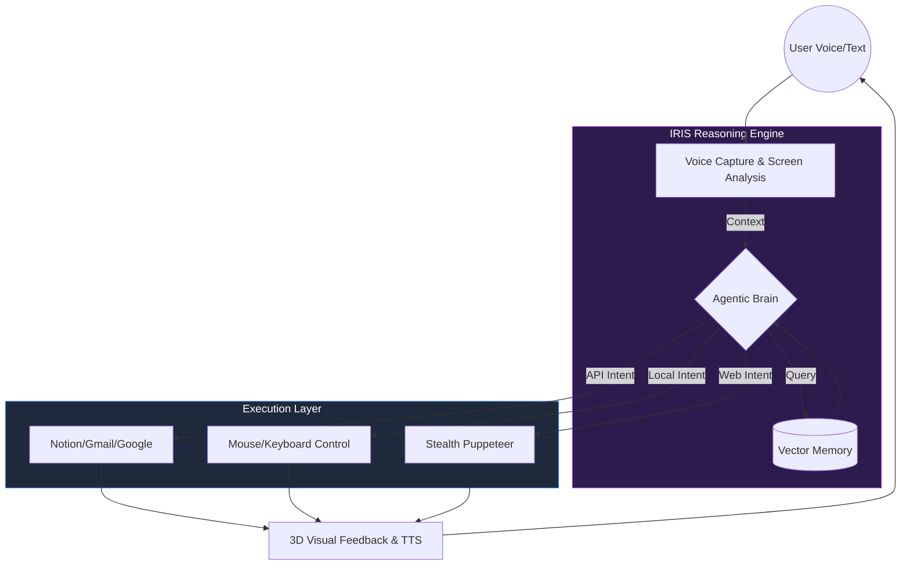

# 👁️ IRIS AI: The Voice-First Operating Layer

[](https://github.com/krishrathi1/Next-Gen-Friend)
[](LICENSE)

**IRIS** (Intelligent Robotic Interaction System) is not just another chatbot. It is a high-performance **Voice-First Operating Layer** that sits on top of your desktop environment. Unlike standard LLM interfaces, IRIS **watches** your workflow, **understands** your screen context, and **executes** keyboard/mouse actions autonomously.

---

## 🚀 Core Capabilities

| Feature | Description |
| :--- | :--- |
| **Visual Computing** | Real-time screen analysis using OCR (Tesseract) and Vision Models to "see" what you see. |
| **GUI Automation** | Autonomous control over your mouse and keyboard using `nut.js` to perform tasks on your behalf. |
| **Agentic Browser** | Integrated Puppeteer engine for stealthy web automation and research. |
| **Memory & Context** | Persistent storage via **Supabase** and local vector databases to remember your preferences and snippets. |
| **Voice Interface** | Hands-free control with advanced audio processing and low-latency response times. |

---

## 🛠️ System Flow Architecture

The diagram below illustrates how IRIS processes a single voice command from perception to physical execution.



---

## 📂 Project Structure

- `src/main`: Electron backend handling system-level permissions (window management, mouse hooks).
- `src/renderer/src/views`:
  - **Dashboard**: The HUD for system status.
  - **WorkFlowEditor**: A visual node-based builder (`ReactFlow`) for creating custom automation chains.
  - **Phone**: Mobile synchronization layer.
  - **Notes**: AI-enhanced thought storage.
- `supabase`: Database migrations and edge functions for synchronization.

---

## 🛠️ Tech Stack

- **Framework**: [Electron](https://www.electronjs.org/) + [Vite](https://vitejs.dev/)
- **UI Architecture**: React 19, TailwindCSS, Framer Motion, GSAP.
- **3D Engine**: Three.js (@react-three/fiber) for premium visual feedback.
- **AI/LLM**: Groq SDK, Google Gemini, Hugging Face Transformers.
- **Automation**: Nut-js, Puppeteer Stealth, Node Window Manager.

---

## 📥 Getting Started

### Prerequisites
- Node.js (v20+)
- npm

### Installation
1. Clone the repository:
   ```bash
   git clone https://github.com/krishrathi1/Next-Gen-Friend.git
   cd IRIS-AI
   ```
2. Install dependencies:
   ```bash
   npm install
   ```
3. Set up your `.env` (Use `.env.example` as a template).
4. Run in development mode:
   ```bash
   npm start
   ```

---

## 📜 Professional Disclaimer
IRIS is designed for high-efficiency desktop automation. It requires permissions to manage windows and capture screen content to function as an "Operating Layer." 
